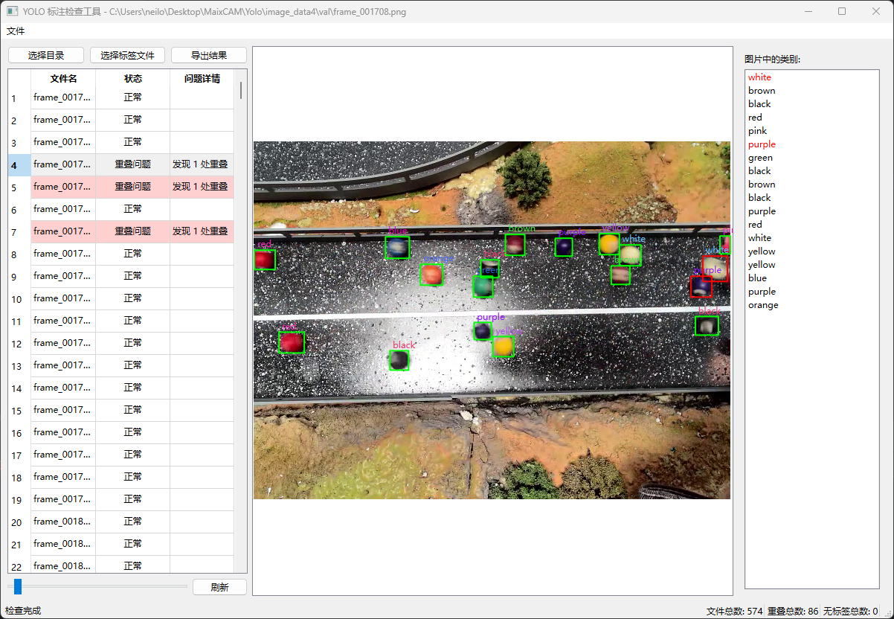

# YOLO 标注检查工具

一个基于 Python 和 PySide6 的桌面应用程序，用于检查和编辑 YOLO 格式的标注文件。


## 


## 功能特点

### 1. 文件管理
- 支持选择和加载包含图片及标注文件的目录
- 支持加载 classes.txt/labels.txt 标签文件
- 文件列表以表格形式展示，包含状态和问题详情

### 2. 标注检查
- 自动检测标注框重叠问题
- 检查标签序号是否有效
- 可调节重叠检测阈值(0-100%)
- 问题文件以颜色标记(红色表示重叠,黄色表示标签问题)

### 3. 可视化与编辑
- 实时预览图片和标注框
- 支持标注框编辑:
  - 拖拽移动
  - 边角调整大小
  - 键盘微调位置
  - 旋转功能
- 显示标签名称
- 标注框颜色区分:
  - 正常(绿色)
  - 重叠(红色)
  - 标签问题(黄色)

### 4. 快捷操作
- A/D 键快速切换上/下一张图片
- W 键添加新标注框
- Delete 键删除选中的标注框
- 方向键微调标注框位置
- 双击标签列表快速选择标签

### 5. 其他功能
- 支持导出检查结果为 CSV
- 自动保存/手动保存选项
- 多线程检查，避免界面卡顿
- 状态栏显示统计信息

## 安装说明

1. 克隆仓库:
```bash
git clone https://github.com/your-username/yolo-label-checker.git
cd yolo-label-checker
```

2. 创建虚拟环境:
```bash
python -m venv venv
source venv/bin/activate  # Linux/Mac
venv\Scripts\activate     # Windows
```

3. 安装依赖:
```bash
pip install -r requirements.txt
```

## 使用说明

1. 启动程序:
```bash
python src/main.py
```

2. 基本操作流程:
   - 点击"选择目录"加载数据目录
   - 如果目录中没有 classes.txt，可以手动选择标签文件
   - 调整重叠阈值(默认 60%)
   - 点击文件列表中的文件进行预览和编辑
   - 需要时可以导出检查结果

3. 快捷键:
   - A: 上一张图片
   - D: 下一张图片
   - W: 添加标注框
   - Delete: 删除选中的标注框
   - 方向键: 微调标注框位置
   - Ctrl+E: 编辑标签

## 项目结构

```
yolo-label-checker/
├── src/
│   ├── main.py              # 程序入口
│   ├── ui/
│   │   ├── main_window.py   # 主窗口
│   │   ├── workers.py       # 工作线程
│   │   ├── widgets/
│   │   │   └── editable_box.py  # 可编辑标注框
│   │   └── dialogs/
│   │       ├── label_editor.py   # 标签编辑器
│   │       └── settings_dialog.py # 设置对话框
│   └── core/
│       ├── annotation.py    # 标注文件处理
│       └── checker.py       # 检查器实现
├── requirements.txt
└── README.md
```

## 贡献指南

欢迎提交 Issue 和 Pull Request。在提交 PR 前，请确保:

1. 代码符合 PEP 8 规范
2. 添加必要的测试
3. 更新相关文档

## 许可证

This project is licensed under the GNU Affero General Public License v3.0 - see the [LICENSE](LICENSE) file for details.